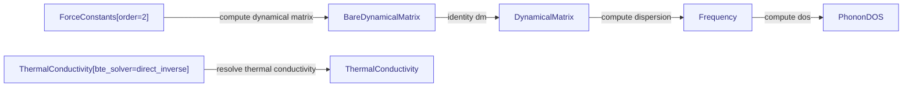

<p align="center"></p>

# openmaterials-ai

[](https://openmaterials.ai/)


A typed substrate for computational materials science. Workflows are directed
acyclic graphs of typed physics *spaces* connected by *operators* that carry
symbolic (sympy) formulas. Each external code (kaldo, phono3py, phonopy,
ShengBTE, LAMMPS, GPUMD) is a *representation*: a per-code mapping of its
numerical output onto the shared operator layer. Because every quantity is typed
and every edge carries its formula, the framework reconciles results across codes
mechanically, runs calculations itself, and validates them. This is the best
semantics for AI: the semantic layer (omai/semantics.py, docs/data/semantics.json)
resolves the fuzzy language of papers and LLMs ("quasi-harmonic-approximation",
"phonon-thermal-conductivity") to typed, gated, content-addressed identities,
so an agent that grounds its phrase through resolve() inherits the formula, the
dimensional proof, the producing codes with citations, and the evidence with
provenance. Fuzzy language in, checkable identity out.

Browse the map as an interactive [3D view](https://openmaterials.ai/map/). The
map spans eleven physics domains (thermal transport, DFT ground state,
mechanics, stability, thermochemistry, quasi-harmonic, molecular, electronic
transport, materials, composites, and the thermodynamic identities that close
its formulas together), holding 114 typed quantities and 114 operators mapped
across [31 cited codes](https://openmaterials.ai/codes/) (the codes
bibliography lists each one with its interface, citation, and license). The
project's single source of truth (vision, product, architecture, kernel, status,
and the ingest/extend/encode procedures) is
[docs/openmaterials.pdf](docs/openmaterials.pdf) (LaTeX source alongside it).
The same document is readable as HTML at
[openmaterials.ai/document/](https://openmaterials.ai/document/), with the PDF
downloadable there; the page is generated from the LaTeX source by
`PYTHONPATH=. python -m omai.doc_html`.

The database is just files in this repo: the versioned map lives in `map/`
(log-first, content-addressed); the site reads `docs/data/graph.json`
(variables + formulas), `docs/data/catalog.json` (per-node grounding: symbol,
dimension, description), `docs/data/codes.json` (per-code variable coverage),
`docs/data/instances/` (one file per value), and `docs/data/configurations/`
(one file per atomic structure: the content-addressed home of a `Structure`
value, bundled to `docs/data/configurations.json`). Rebuild the generated files
with:

```bash
CUDA_VISIBLE_DEVICES="" PYTHONPATH=. python -m omai.map_data
```

To append a value, add a JSON file under `docs/data/instances/` and open a pull
request. What you contribute stays yours: appending grants the map a
non-exclusive CC BY 4.0 license, never a transfer, and the raw simulation or
experimental artifacts behind a value are never ingested (GOVERNANCE.md, "Data
ownership and fairness").

## Share an experiment with a link

Every instance carries a provenance reference (`source.ref`), and that ref is
the experiment key: all the values one simulation campaign, measurement, or
parsed paper contributed, grouped. The [experiments
page](https://openmaterials.ai/experiment/) lists every group in the store and
gives each one a permalink:

```
https://openmaterials.ai/experiment/#ref=paper:cnt-2021-barbalinardo
```

The page renders the group's values with conditions and uncertainty, its
verbatim provenance quotes, and the map version it was built from, so the link
you share carries the result and its receipts together. To share your own
experiment, contribute its values as instances under one `source.ref` and send
the URL.

For a card whose quantity [MaterialsCodeGraph](https://materialscodegraph.com/)
can actually run, the page adds one more action: a **Run on MaterialsCodeGraph**
link that deep-links MCG's compute wizard (`#/new/<node id>`) prefilled from the
lineage. It is optional and storage-free: it appears only for genuinely runnable
nodes and is simply absent otherwise, adds no data and touches no record, and
the card is identical without it.

OpenMaterials provides templates and lineages; MaterialsCodeGraph stores
experiments and runs simulations from lineages.

Glossary:

- THE LINEAGE (the schema) is one versioned artifact holding the derivation
  graph and the instance-format rules, published as `docs/data/lineage.json`
  with an append-only version chain in `docs/data/versions.json`. Its rolling
  `lineage_version` is a content hash over both halves; the six gates are its
  amendment process; the map is its visualization.
- A lineage (an instance) is the shareable run record defined in
  `omai/lineages.py`: a pinned path through the artifact, identified by the
  hash of its `lineage` object alone.
- Source is a lineage's namespaced origin, a `scheme:ref` string inside the
  hash (`paper:...`, `doi:...`, `zotero:...`, `arxiv:...`): identity-bearing,
  so the same claim from the same source mints the same id while one paper's
  several results stay distinct records. Legacy top-level `source` objects on
  old records ride outside the hash forever and never re-mint an id.
- Provenance is a quantity instance's source reference, `source.ref`.
- Derivation is a node's upstream graph in the map.

A lineage can also be shared as a link on its own, with no store or server. The
record is light and lineage-identified: its identity comes from its `lineage`
field (a map node when known, else a template with its hyperparameters and setup
values), and heavy artifacts are optional pointers to
[MaterialsCodeGraph](https://materialscodegraph.com/), never embedded. Because
it is light, the whole record gzips into a `#x=` link fragment that opens in the
playground's Lineage tab:

```
https://openmaterials.ai/play/#/play?tab=lineage&x=<gzipped record>
```

A committed value also has a canonical permalink, `/l/<lineage id>`, resolved
at the edge by the site Worker (`infra/site`: the same `docs/` served as
Cloudflare assets plus the dynamic routes; everything else is static
fallthrough, so the Worker is additive over the static site). The permalink
unfurls with the value's own Open Graph card and redirects to the playground
datasheet. An uncommitted bundle can be stored for a short link instead:
`Copy short link` on the bundle view mints `<site>/s/<code>` (a public,
rate-limited KV store on the Worker), which unfurls from the stored envelope
and reopens the full datasheet page anywhere, with no URL-length limit.

Opening the link renders straight into a **full-width, dense, plain datasheet**:
a lineage is a data container, and OpenMaterials (the static site) is the
container's viewer, so the view shows the information the record holds, plainly,
not a dashboard. Opening the Lineage tab without a record lazily loads the
committed `si-kappa-kaldo-direct` lineage into the same datasheet, with plain
links to the other nine committed examples. It
presents what the record is (the kind, simulation or measurement, the output map
node, the material, and the short lineage id), the lineage's every field as plain
labelled key-values and a simple value-and-units table (node, node_uid, material
and its pinned configuration, template, all hyperparameters, conditions, params,
and the execution: code, version, container digest, runner, wall time, seeds),
what it means on the map (the node's plain-language description, units, and map
tier pulled from the catalog, and the lineage's X&rarr;Y path stated plainly as its
inputs and its output, for example "Inputs: Potential, Force constants,
Structure, Temperature. Output: Thermal conductivity."), its provenance (the
source ref, and for a parsed paper the paper info), and where the data lives (the
artifact pointers and the mirror host as plain links out, since the heavy bytes
live on MaterialsCodeGraph or Zenodo and the container only points). It ends with
a plain **Run this lineage as a simulation on MaterialsCodeGraph** link when the
node is one MCG can compute (simply absent otherwise) and a Copy link that re-mints
the same `#x=` share URL, so the view is shareable and replayable. **Dashboards and compute live
on MaterialsCodeGraph, not here**: the rich visualization and the running or
replaying are MCG's job; this view is the faithful, plain record. Use **paste
another** in the datasheet, or return to the Lineage tools, to paste a record JSON
or drop a `.json` file (a record MCG serves pastes straight in) and open a
datasheet of your own; the paste/drop ingress validates the record
client-side against the same light shape checks as `validate_light` (lineage
present, artifact pointers well-formed) and is honest about gaps (a
node-unresolved or measurement record still shows its data plainly, without a
fabricated lineage and without a Run link, and says so). It is a view only,
nothing is uploaded or stored, and every reference file it reads (graph, catalog)
is static. The fragment uses the same gzip+base64url scheme as the map-view share
below, so a link a tool produces (`record_to_fragment`) and one the playground
produces interoperate. It is the light path: a record with many artifact pointers
may exceed a practical URL, and that is fine.

One link can also carry SEVERAL lineages at once: the share **envelope**
(`omai/lineages.py`: `envelope`, `envelope_to_fragment`,
`envelope_from_fragment`). An envelope is
`{"v": 1, "doc": {...}, "lineages": [record, ...]}`, where `doc` is shared
document context, publication metadata for a parsed paper (`source` as a
`scheme:ref` string, `title`, `authors`, `year`, `journal`, extras tolerated),
and each member is an ordinary light record. The read side is dual: every
legacy single-record fragment ever minted still decodes, normalized to a
one-element envelope with no doc, so no existing link breaks; new encoders
emit the envelope. Bundling never changes a member's id (identity stays each
member's own lineage), the bundle gets a derived `bundle_id` (the sha256 of the
canonical JSON of `{"doc": doc-or-null, "ids": [member ids in order]}`), and a
member with no source of its own inherits `doc.source` at read/display time
only, never into its hash. Opening a multi-lineage link in the playground
renders a plain paper view (the doc header over the member list, each member
one click from its full datasheet); a single-lineage envelope or a bare record
renders the datasheet exactly as before. When a minted link would exceed a
practical URL length (8000 characters), the playground says so plainly and
offers the envelope as a JSON download instead of a broken link.

The playground's Distance tab presents the `omdc` layer the same way the rest
of the site presents its data: the metric registry and the illustrative
silicon zoo render from `docs/data/distances.json`, emitted by the build from
the registry itself (`omai/distance_data.py`, skipped without the distance
extras), and pairwise committed-configuration distances appear automatically
as configurations land.

The [cross-code agreement page](https://openmaterials.ai/agreement/) takes the
other cut through the same instances: instead of grouping by source, it groups
by the physical question. It finds every set of values that are the same
observable, the same material, and the same physical conditions, differing only
in the method or the code that produced them, and reports their spread:

```
https://openmaterials.ai/agreement/
```

Because only values that answer the identical physical question are ever placed
side by side (same base quantity, material, and every physical condition, differing
solely in estimator), a spread there is a real method or code disagreement, never
an apples-to-oranges artifact. The strongest comparisons are cross-code (the same
method run by two codes on the same inputs) and theory-versus-experiment (a
measurement on the same node as a simulation), both badged.

Views are links too: the map takes `#node=<id>` (and writes it as you click)
and `#experiment=<source.ref>` to light up exactly the quantities an
experiment's evidence covers,
the tracer takes `#node=<id>` or `#from=<id>&to=<id>` for a derivation path,
the playground serializes its whole state behind its Share button and takes
`#x=<gzipped record>` to open a single light lineage record as a plain data
view (what the container holds: every lineage field, a value-and-units table, what
the output node means on the map, where the data lives, and a plain link to run
it as a simulation on MaterialsCodeGraph), and the experiments index takes
`#material=<name>`. Every page has a copy-link control.

## The verified layer (Lean 4)

[](https://github.com/openmaterials-ai/openmaterials-ai/actions/workflows/lean.yml)

The map's dimensional structure and its rational identities are proven in
Lean 4: every exported node is a physics dimension checked against
[physlib](https://github.com/leanprover-community/physlib) (the community
Lean 4 physics library, pinned by rev on toolchain 4.31.0), and every
mechanically provable operator identity is a real-valued theorem checked
against Mathlib. `lean/` is a standalone lake package; `cd lean && lake exe
cache get && lake build` reproduces the proof, and CI recompiles it on every
change with warnings promoted to errors. The
[verified layer](https://openmaterials.ai/lean/) page renders what is proven
with honest coverage counts, and the
[formalization roadmap](https://openmaterials.ai/lean/roadmap/) rates every
operator on the map by what a proof of its formula would take, from
generator-provable algebra to the open analysis frontier (Brillouin-zone
sums, correlation integrals). A hand-reviewed
[crosswalk](https://openmaterials.ai/data/physlib_crosswalk.json) links map
nodes to the physlib declarations that formalize the same concept, so
`resolve()` can hand an agent the formal lemma alongside the formula.

## A slice of the map, as Mermaid

Any sub-map exports as a Mermaid flowchart (`python -m omai.mermaid <node>`),
so a lineage renders natively in GitHub markdown, issues, and PRs:



The playground's Map tab has a Copy as Mermaid button for any view you build.

## Library contract

From 0.1.0 `openmaterials-ai` is the one implementation of record identity,
shape and rendering. mapengine and the MaterialsCodeGraph pipeline import it
instead of reimplementing it, and the MaterialsCodeGraph worker (TypeScript,
where importing is not an option) asserts its own copy against the vectors
shipped here.

**The public functions.**

| function | contract |
|---|---|
| `omai.lineages.lineage_id(lineage)` | The record id: sha256 of the canonical lineage. Identity is the lineage alone. |
| `omai.lineages.canonical_id(lineage, execution=None, artifacts=None)` | The same id. Execution and artifacts are accepted for older call sites and ignored. |
| `omai.lineages.record_lineage(record)` | A record's lineage, accepting the legacy `recipe` key. |
| `omai.lineages.record_simulation(...)` | Writes a strict, checksummed record. |
| `omai.schema.simulation_record_schema()` | The SimulationRecord as JSON Schema draft 2020-12, closed objects. |
| `omai.schema.validate_record(record)` | Every schema violation as a readable message; an empty list means valid. |
| `omai.render.render_kappa / render_molar_cp / render_reaction_energy` | A typed result to a map evidence `Instance`. |
| `omai.render.provenance(run_ref, what, map_version=...)` | The `Source` every rendered instance carries, stamping the map version. |

The schema is a SHAPE gate. That `id` equals `lineage_id(lineage)`, that the
node resolves against the live map, and the contribution gates in
`omai.gates` are separate checks: a schema cannot hash.

It describes a CURRENT record, the one carrying its lineage under `lineage`.
A legacy record using the pre-rename `recipe` key is out of scope and is
refused, although `record_lineage` still reads it: the schema states the shape
new records are written in, and widening it would keep the legacy spelling
alive in every consumer that validates. Normalize such a record before
validating it (`{**record, "lineage": record_lineage(record)}`, minus the
`recipe` key); legacy links stay readable through `record_lineage` forever.

**The vectors.** `omai/vectors/*.json` ship inside the wheel.

- `lineage_ids.json`: 32 lineages, each with its canonical JSON, `lineage_id`,
  and `canonical_id` with and without an execution block. Sources: the four
  openmaterials commons conformance targets, the 27 adversarial float/int
  vectors MaterialsCodeGraph pins in Python and TypeScript, and the kaldo
  external-solve fixture.
- `records.json`: 33 full records with their ids, including one carrying
  artifacts and mirrors whose id equals its artifact-free twin.
- `render.json`: renderer inputs and the instances they render to.

Every id in these files is produced by the functions above and equals the id
its source already pinned. A vector whose id changes is a defect in the
canonicalization, never a reason to regenerate; `python -m omai.tools.gen_vectors`
refuses to write when a recomputed id disagrees with its pin.

**Versioning.** Semantic versioning, with identity treated as the strongest
promise: a change to `lineage_id`, to the canonical JSON, or to a vector's id
is breaking and takes a major version, because every id ever minted by this
library would stop reproducing. Adding a schema field, a renderer, or a vector
is a minor version. Consumers pin an exact version (`openmaterials-ai==0.1.0`).

## Install

```bash
pip install -e ".[dev]"   # Python 3.11+
```

## Try it

A self-contained tour that needs no external codes:

```bash
python examples/quickstart.py
```

It builds the operator DAG, derives molar heat capacity from a phonon
frequency array, and cross-checks two inputs at a gauge-invariant observable.

## Parse a paper

The paper parser turns a PDF into a gated evidence proposal (detect reported
values with verbatim quotes, map them onto the node catalog, validate against
the kernel, review, then propose):

```bash
python -m omai.paper_parser <pdf>                # writes a proposal; nothing lands
python -m omai.paper_parser <pdf> --apply --yes  # human-confirmed: writes instances
```

It needs its own extras (`pip install -e ".[parser]"`, already included in
`[dev]`) and an `ANTHROPIC_API_KEY` (environment or a repo-root `.env`); the
key is never printed or logged.

The CLI also prints the paper's share envelope: an `envelope_fragment` that
bundles one minimal lineage per claim clearing the apply bar, with
`paper:<slug>` as the shared document source. Paste it after
`play/#/play?tab=lineage&x=` and the playground opens the whole parsed paper
as its plain paper view; each member's id equals the id the applied instance
would carry, so sharing before applying and applying then sharing agree.

## Run the tests

```bash
pytest
```

## Layout

```
map/                 # the versioned protocol artifact: log-first, content-addressed
                     #   (log.jsonl, current/ materialized view, GENESIS hash)
index/               # the source registry: per-code coverage pinned to the map version
omai/
  operator/          # operator layer: Spaces, Operators, sympy formulas,
                     #   gauge discipline, validate_dag, dimensions, identity;
                     #   learned.py: LearnedOperator, ML surrogates as declared,
                     #   non-authoritative shortcuts of exact-edge paths
  representation/    # the bridge: units, normalizations, per-code specs,
                     #   compare, and the execute/compose/cross-check runtime
  thermal_transport/ # ten per-domain packages: each carries an operator/ DAG
                     #   (Spaces + Operators) and a representation/ set of per-code
                     #   adapters. thermal_transport spans kaldo, phono3py, phonopy,
                     #   shengbte, qe, ase, lammps, gpumd
  dft_ground_state/  # QE DFT ground state: structure, energy, forces, stress
  mechanics/         # elastic tensor, Voigt moduli, pressure (lammps, mat-elasticity)
  stability/         # formation and hull energies, magnetism (pymatgen, mp-api)
  thermochemistry/   # reaction energies, CALPHAD Gibbs energies (pycalphad, rxn-network)
  quasiharmonic/     # quasi-harmonic thermal expansion, Gruneisen (phonopy QHA)
  molecular/         # NEB barriers, bond dissociation energies (orca, openmm)
  electronic_transport/ # carrier transport, Nernst-Einstein conductivity (amset)
  materials/         # materials-diffusion subgraph, skills_catalog.json (AtomisticSkills)
  thermodynamic_identities/ # six executable relations closing the map's formulas
                     #   together (Gruneisen, kappa_total, molar volume, C_P-C_V, PF, ZT)
  paper_parser/      # P1 paper parser: PDF -> gated evidence proposal (six stages)
  configurations.py  # structure-valued evidence: content-addressed atomic cells
  map_data.py        # unified multi-domain export -> docs/data/*.json
  store.py           # log-first store: push/read/diff/verify
infra/
  learn-proxy/       # cost-gated Cloudflare Worker relaying the Learn-page parser demo
examples/            # runnable tours; start with quickstart.py
experiments/         # full cross-code material studies (silicon, germanium, NaCl)
tests/               # pytest suite
docs/                # the openmaterials document + the openmaterials.ai site
                     #   (map, map-trace, learn, deck, map-lab)
```

## Structure and stewardship

The project is one map in three parts. The map itself (the versioned graph,
its evidence, and the rules that govern changes) is the commons, stewarded
by OpenMaterials-AI, an open initiative structured as a foundation in
formation: map data is CC BY 4.0 (LICENSE-DATA), the kernel is Apache 2.0
(LICENSE), and GOVERNANCE.md states the boundary rule and the graduation
path. The interfaces (the site, the views, the bibliography tooling) and
the AI improvement engine (the paper parser, the scan agents) are built by
Da Vinci Labs on top of the commons. Cite via CITATION.cff, stating the map
version (docs/data/version.json) your work used.

Evidence stays its owner's. Contributing a value grants the map a
non-exclusive CC BY 4.0 license and transfers nothing; there is no copyright
assignment and no CLA; raw simulation and experimental artifacts are never
ingested and remain under their owners' own terms. Attribution is enforced
in both directions: upstream, every mapped code's citation and license is
recorded in its rail and every parsed paper is quoted verbatim with page
anchors as a merge gate; downstream, reuse must credit the map version and,
through it, the original sources. The full statement is GOVERNANCE.md,
"Data ownership and fairness".

## Design

The architecture is Part III of `docs/openmaterials.pdf`; the implemented kernel
(dimensions, identity, store, genesis) is Part IV. Read the Principles and the
two-worlds section first.
